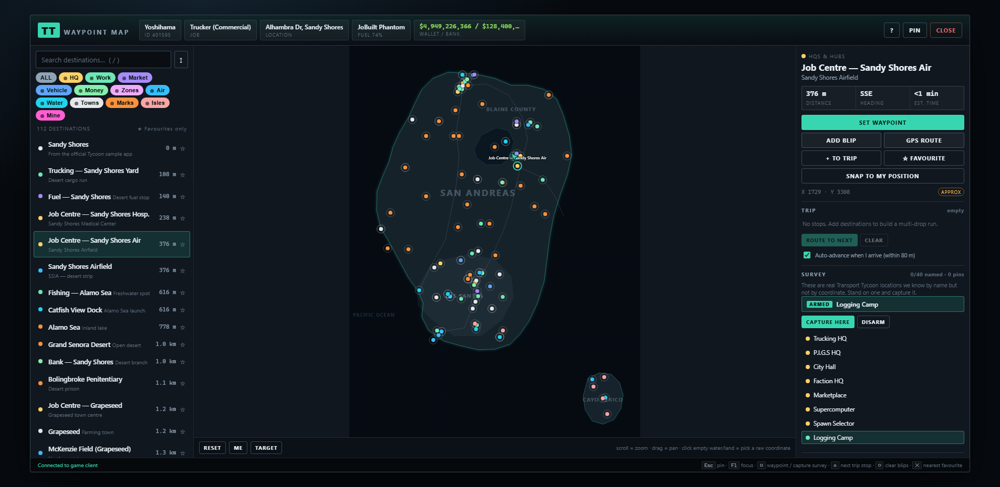

# TT Waypoint Map

An in-game waypoint map for **Transport Tycoon** (FiveM). It runs as a
[Tycoon User Application](https://dash.tycoon.community/wiki/index.php/User_Applications):
you press <kbd>F1</kbd> in game, paste the URL, and the map opens inside the game window
with every job centre, job site, airport, dock, landmark and island one click away from a
GPS route.



---

## What it does

| | |
|---|---|
| **112 destinations** | Job centres, job sites, airports & airstrips, docks and marinas, cities, landmarks, islands (Cayo Perico) and services, all searchable and filterable by category. |
| **Survey mode** | 40 real Transport Tycoon locations that the app knows by name but not by coordinate. Arm one, drive to it, press a key — it becomes an exact pin. See [About the coordinates](#about-the-coordinates). |
| **Live distance & ETA** | Reads your real position from the game client, sorts the list nearest-first and estimates travel time from what you are actually driving (truck, plane, boat, on foot). |
| **One-click navigation** | `SET WAYPOINT` drops the in-game marker. `GPS ROUTE` also places a coloured map blip and draws the driving line. |
| **Trip planner** | Queue several stops for a multi-drop run. Get within 80 m of the next stop and the app ticks it off, plays a sound and routes you to the one after it. |
| **Your own waypoints** | Save wherever you are standing (`＋ HERE`), or the marker you dropped on the pause map (`＋ MAP WAYPOINT`). Export/import them as JSON. |
| **Correct the map** | Any pin marked `APPROX` can be fixed by driving there and pressing `SNAP TO MY POSITION`. The correction is stored per-player and survives restarts. |
| **Pinned tracker** | Press <kbd>Esc</kbd> and the UI collapses to a slim strip showing distance and heading to your target, so it stays useful while you drive. |
| **In-app hide** | `HIDE` (or <kbd>H</kbd>) collapses everything to a small handle without handing the app back to the client — see [Hide vs. the client's Hide](#hide-vs-the-clients-hide). |
| **Keybinds** | The Square / Triangle / Circle / Cross binds are wired to waypoint, next trip stop, clear blips and nearest favourite. Two more show up in *Settings → Keybinds → FiveM*. |

---

## Deploying to Cloudflare

The app is completely static — no build step, no server code. Cloudflare just serves
`public/` from the edge.

```bash
npm install
npx wrangler login      # first time only
npm run deploy
```

Wrangler prints the URL, e.g. `https://tt-waypoint-map.<your-subdomain>.workers.dev`.
**That URL is what players paste into the F1 box.**

Other scripts:

```bash
npm run dev     # local server on http://127.0.0.1:8787
npm run check   # validate the config without deploying
npm run tail    # live request logs from the deployed worker
```

To use your own domain, add a route in `wrangler.jsonc` or attach a custom domain from the
Cloudflare dashboard (Workers & Pages → your worker → Settings → Domains & Routes).

### Two things not to break

* **Do not add `X-Frame-Options` or a `frame-ancestors` CSP.** The game loads the page in
  an iframe; either header makes it render as a blank rectangle. See `public/_headers`.
* **Keep `Cache-Control: no-cache`.** The FiveM client's embedded browser caches hard, and
  without revalidation players keep seeing an old build long after you deploy.

---

## Using it in game

1. Press <kbd>F1</kbd>.
2. Paste your deployed URL and press Enter.
3. Search or click a pin, then `SET WAYPOINT` / `GPS ROUTE`.
4. Press <kbd>Esc</kbd> to hand control back to the game while keeping the tracker on screen,
   or <kbd>F1</kbd> to bring the app back into focus.

You can run up to five user apps at once via **New Tab**, and switch between them with
<kbd>Tab</kbd> immediately after opening the interface.

### Hide vs. the client's Hide

The Tycoon client's own toolbar already has **Hide**, next to Pin and Remove Tab. That one
takes the app off screen entirely and you need <kbd>F1</kbd> to get it back. The app's own
`HIDE` button is a different thing:

|  | Client's **Hide** | App's **HIDE** (<kbd>H</kbd>) |
|---|---|---|
| Restore with | <kbd>F1</kbd>, then find the tab | One click on the handle, or a bound key |
| What stays on screen | Nothing | A small handle showing your current target and its distance |
| Needs the F1 interface | Yes | No |
| Survives a reload | No | Yes — the state is remembered |

Behaviour is a grid of two independent switches — the client's pin state, and the app's own
hide:

|             | not hidden        | hidden |
|-------------|-------------------|--------|
| **focused** | full UI           | small handle, click to restore |
| **pinned**  | tracker strip     | **nothing at all** |

That bottom-right cell is the point: hidden *and* pinned paints absolutely nothing, so you
get a completely clean screen while the app keeps running — trip stops still auto-advance,
arrival sounds and notifications still fire. Bind **TT Map: show / hide** in
*Settings → Keybinds → FiveM* to toggle it back without leaving the driver's seat.

The handle can never disappear while the app is focused, so hiding can't strand you with an
invisible app and no way back. Right-click it to move it to another corner if it clashes with
the game HUD.

---

## Developing without launching GTA

Open **`/simulator`** on the dev server. It stands in for the game client: it speaks
the exact same `postMessage` protocol, feeds the app a fake player you can drive around
with the N/S/E/W buttons or teleport across the map, fires the keybind triggers, and logs
every command the app sends back.

```bash
npm run dev
# then open http://127.0.0.1:8787/simulator
```

(Cloudflare's asset server strips `.html`, so `/simulator.html` just redirects there.)

---

## How the integration works

The client loads this page in an iframe and talks to it purely over `postMessage`.
Everything is wrapped in [`public/game.js`](public/game.js).

**Sending commands** — `window.parent.postMessage({ type, ...args }, '*')`:

```js
import { cmd } from './game.js';

cmd.setWaypoint(-267, 6231);                  // drop the in-game marker
cmd.buildBlip({ id: 'x', x: 1601, y: 3662,    // create a map blip…
                sprite: 1, color: 5, route: true, name: 'Sandy Shores' });
cmd.notification('~g~Waypoint set');          // GTA colour codes work
cmd.pin();                                    // give control back to the game
```

**Receiving state** — the client pushes only the keys that changed, so ask for the whole
cache once at boot with `cmd.getData()`:

```js
import { state, onData, playerPos } from './game.js';

onData((changedKeys) => {
  if (changedKeys.includes('pos_x')) console.log(playerPos());
  console.log(state.name, state.job_title, state.wallet, state.zoneName);
});
```

**Keybind triggers** arrive as data keys prefixed `trigger_`, and are events rather than
state:

```js
import { onTrigger, cmd } from './game.js';

onTrigger('square', () => cmd.notification('Square pressed'));
cmd.registerTrigger('ttmap_next', 'TT Map: route to next trip stop');
```

The authoritative protocol reference is served by the game server itself:
<http://server.tycoon.community:30125/status/config/user-apps>

---

## About the coordinates

This is the honest part of the project, so it is worth reading.

Every pin carries a precision badge:

* **VERIFIED** — taken from the official Tycoon sample app.
* **APPROX** — derived from the San Andreas map. Good enough to drive to, but it may put
  you a few dozen metres off the exact door or depot gate.
* **YOUR FIX** — you corrected it with `SNAP TO MY POSITION`.
* **SURVEYED** — you stood on it and captured it. Exact.

Only the three cities in the official sample (Los Santos, Sandy Shores, Paleto Bay) ship as
VERIFIED. The Tycoon wiki documents job *names* but not coordinates, and the API needs a
private key, so everything else geographic is best-effort.

### Survey mode

The **category list and place names come from the game's own pause-map blip legend** —
Trucking HQ, P.I.G.S HQ, Logging Camp, Sorting Facility, McKenzie Export, Lombart Bay Sugar
Mill, Bristols Storage, Sandstone Collector, Recycling Plant, Prospecting, the whole
`Market (…)` family, Loan Office, Spawn Selector, Vehicle Booster, and the rest.

Those names are real. Their coordinates are not published anywhere, and there is no data key
that hands them over, so **they ship unmapped rather than guessed** — a confidently wrong pin
that sends you to the far side of Blaine County is worse than no pin at all.

Mapping one takes seconds:

1. Open **Survey** in the right-hand panel and click a name to arm it.
2. Press <kbd>Esc</kbd> and drive there. The pinned strip keeps showing what you armed.
3. Stand on it and press the **Square** keybind (or `CAPTURE HERE`).

It immediately becomes a full destination — searchable, routable, badged `SURVEYED`.

Names that exist many times over (37 ATMs, a gas station per town, every Los Santos Customs)
stay armed after a capture and number themselves `ATM`, `ATM #2`, `ATM #3`… so you can walk a
row of them without touching the mouse.

`EXPORT` hands you the JSON. Paste the `surveyed` array into `public/data.js` and the
coordinates ship for every player.

### The base map

The outline in `data.js` is a stylised silhouette, not a game rip. Its vertices are anchored
to places that genuinely sit on the shore — Del Perro Pier, Chumash, Paleto Bay, LSIA, the
Port of LS, Humane Labs, Fort Zancudo — so pins fall on the correct side of the water even
though the curve between them is freehand.

---

## Layout

```
public/
  index.html      markup and layout
  styles.css      in-game HUD styling (transparent background — you see the game through it)
  app.js          UI controller: list, search, selection, trips, favourites, persistence
  map.js          the interactive SVG map (pan, zoom, markers, live player arrow)
  game.js         the postMessage bridge to the Tycoon client
  data.js         destination catalogue + base map geometry
  simulator.html  fake game client for local development
  _headers        cache and security headers
wrangler.jsonc    Cloudflare deployment config
```

Adding a destination is one line in `public/data.js`:

```js
{ id: 'jb-mine', n: 'Quarry — Loading Bay', c: 'job', x: 2950, y: 2790, p: 'approx', d: 'Ore pickup' },
```
